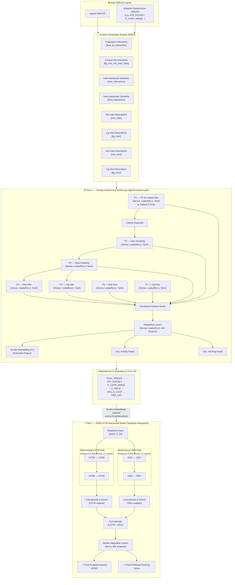
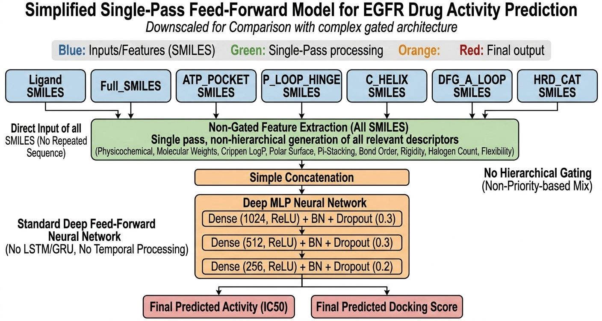
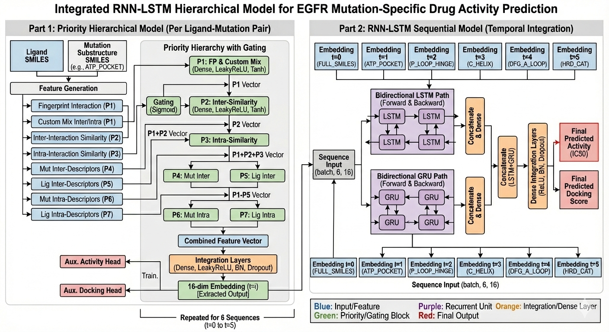
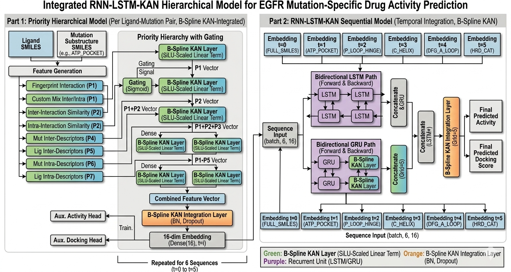
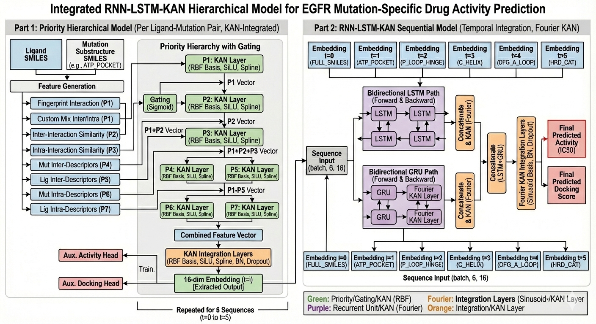
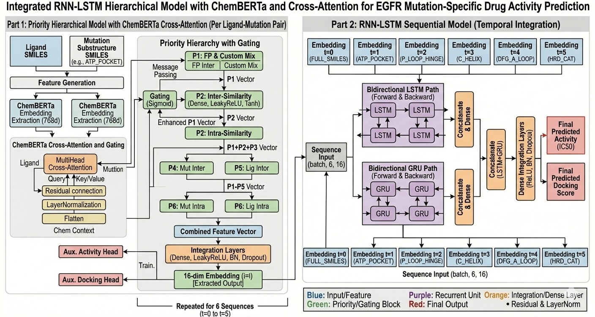
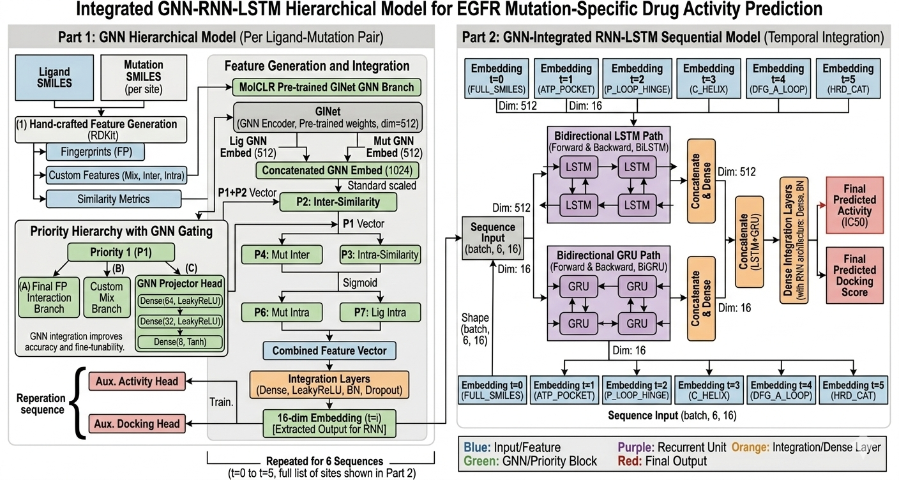
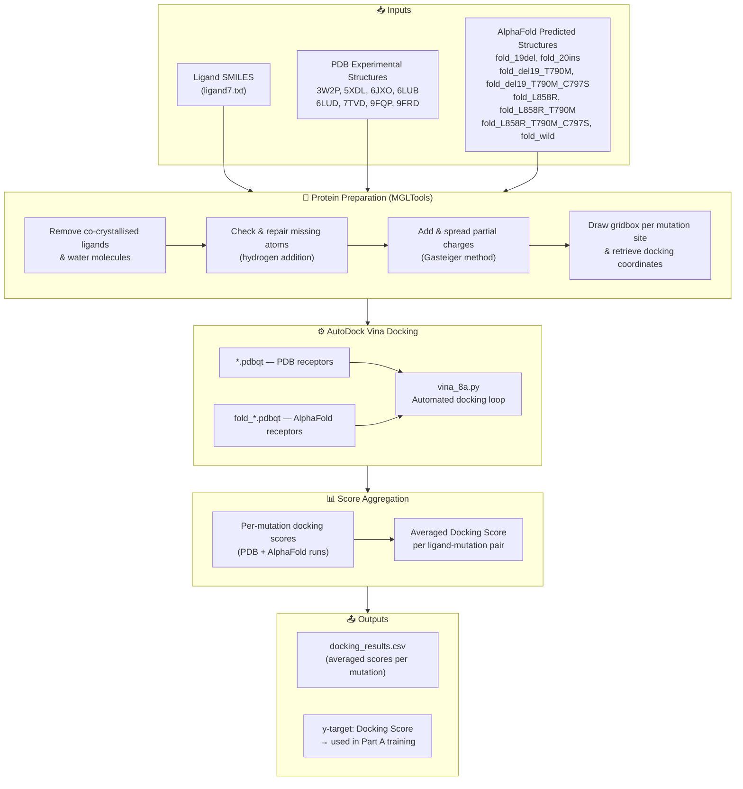
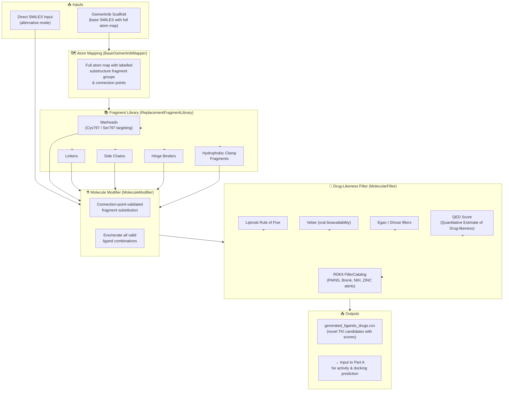

<div align="center">

# 🧬 EGFR-NSCLC Drug Discovery ML Pipeline

### Predicting 4th-Generation EGFR Inhibitor Activity Against Non-Small Cell Lung Cancer

[](https://python.org)
[](https://tensorflow.org)
[](https://rdkit.org)
[](https://pytorch.org)
[](https://vina.scripps.edu)
[](#license)

---

*An end-to-end machine learning pipeline featuring **dual-SMILES physicochemical descriptor capture** from both ligand and mutation protein — closing the interaction loop to generate intermolecular, intramolecular, similarity, fingerprint, and custom relationship features from both sides. This enables higher-accuracy prediction of drug activity (IC50) and docking scores for EGFR tyrosine kinase inhibitors targeting resistant NSCLC mutations.*

</div>

---

## 📋 Table of Contents

- [Overview](#overview)
- [Motivation & Background](#motivation--background)
- [A — Activity Prediction ML Pipeline](#a--activity-prediction-ml-pipeline)
  - [Part A Architecture](#part-a-architecture)
  - [Feature Engineering](#feature-engineering)
  - [Model Architectures](#model-architectures)
  - [Script Sets (Set A & Set B)](#script-sets-set-a--set-b)
  - [Datasets](#datasets)
  - [Training & Inference](#training--inference)
- [B — Vina Molecular Docking](#b--vina-molecular-docking)
  - [Part B Architecture](#part-b-architecture)
- [C — Ligand Generator](#c--ligand-generator)
  - [Part C Architecture](#part-c-architecture)
- [Repository Structure](#repository-structure)
- [Installation & Dependencies](#installation--dependencies)
- [Usage](#usage)
- [Results](#results)
- [Assumptions & Limitations](#assumptions--limitations)
- [References](#references)
- [Acknowledgements](#acknowledgements)

---

## Overview

This project is a **drug discovery ML pipeline** for predicting **4th-generation EGFR inhibitor** activity against **Non-Small Cell Lung Cancer (NSCLC)**. It uses molecular data sourced from [ChEMBL](https://www.ebi.ac.uk/chembl/) to train neural networks that predict:

1. **Activity** — IC50 values measuring how potent a drug is against specific EGFR mutations
2. **Docking Score** — how well a drug binds to the EGFR protein across mutation variants

### 🔑 Key Differentiator: End-to-End Dual-SMILES Feature Capture

Unlike ligand-only approaches, this pipeline extracts physicochemical descriptors from **both** the ligand SMILES **and** the mutation protein substructure SMILES. This closes the interaction loop — features are generated from both sides of the binding interaction, enabling the model to learn the **relationship** between a specific ligand and a specific mutation protein pocket, rather than treating the protein as a static label.

```
Ligand SMILES ──→ Ligand Descriptors  ──┐
                                        ├──→ Interaction Features ──→ Neural Network ──→ Prediction
Mutation Protein SMILES ──→ Mutation Descriptors ──┘
                                        │
                            ┌────────────┴────────────┐
                            │  Intermolecular features │
                            │  Intramolecular features │
                            │  Similarity metrics      │
                            │  Fingerprint metrics     │
                            │  Custom relationships    │
                            └─────────────────────────┘
```

The pipeline integrates three interconnected sub-projects:

| Sub-Project | Purpose |
|---|---|
| **A. Activity Prediction** | End-to-end dual-SMILES feature capture + 6 neural network architectures for activity & docking score prediction |
| **B. Vina Docking** | Dock ligands against PDB & AlphaFold EGFR structures to generate docking scores as training targets |
| **C. Ligand Generator** | Generate novel 4th-gen TKI candidates from the osimertinib backbone with customisable fragment substitution |

---

## Motivation & Background

EGFR-mutant NSCLC is treated with **tyrosine kinase inhibitors (TKIs)**, but acquired resistance mutations progressively render each generation ineffective:

```
1st/2nd Gen TKIs ──→ Sensitising mutations (del19, L858R)
       ↓ resistance
3rd Gen TKIs (Osimertinib) ──→ T790M gatekeeper mutation
       ↓ resistance
4th Gen TKIs (needed) ──→ C797S mutation (triple mutants: del19/T790M/C797S, L858R/T790M/C797S)
```

This pipeline aims to **accelerate the identification of 4th-generation EGFR-TKI candidates** by:
- Capturing ligand–mutation protein interactions through physicochemical descriptors
- Ranking novel compounds by predicted activity and docking affinity
- Generating theory-inspired ligand modifications from the osimertinib scaffold

---

## A — Activity Prediction ML Pipeline

### Part A Architecture

The Activity Prediction pipeline is built as two integrated sub-models: a **Priority Hierarchical Forward Network** (per ligand-mutation pair) that produces 16-dimensional embeddings, and an **RNN-LSTM Sequential Model** that processes those embeddings across 6 structural timesteps.



> **Other Model Architectures (M0, M2–M5)** plug into the same dual-SMILES feature generation engine and the same 6-timestep sequence structure. They differ only in how the hierarchical and recurrent layers are implemented (KAN layers, ChemBERTa embeddings, GNN embeddings, or a simple FFN baseline).

---

### Feature Engineering — End-to-End Dual-SMILES Descriptor Engine

The core specialty of this pipeline is its **end-to-end physicochemical descriptor capture from both the ligand and the mutation protein using SMILES**. Both molecules are passed through the same descriptor engine, and the resulting feature vectors are then combined to produce interaction-aware representations.

This dual-source approach means the model doesn't just learn "what makes a good drug" — it learns **what makes a good drug *for a specific mutation***.

#### How It Works

```
                    ┌─────────────────────┐
  Ligand SMILES ───→│  RDKit Descriptors  │───→ Ligand Inter Features (H-bond, charge, LogP, PSA...)
                    │  (same engine)      │───→ Ligand Intra Features (flexibility, rings, complexity...)
                    └─────────────────────┘
                              ↕ 
                    ┌─────────────────────┐
  Mutation SMILES ─→│  RDKit Descriptors  │───→ Mutation Inter Features
                    │  (same engine)      │───→ Mutation Intra Features
                    └─────────────────────┘
                              ↓
              ┌───────────────────────────────────────────────┐
              │            Interaction Feature Layer           │
              │  • Fingerprint overlap (Tanimoto, Dice, MFP)  │
              │  • Custom ratio / diff / product combinations  │
              │  • Inter × Inter similarity                    │
              │  • Intra × Intra similarity                    │
              │  • Mutation inter descriptors                  │
              │  • Ligand inter descriptors                    │
              │  • Mutation intra descriptors                  │
              │  • Ligand intra descriptors                    │
              └───────────────────────────────────────────────┘
                              ↓
                    8 Feature Inputs → Hierarchical Model
```

#### Feature Categories & Priority Order

The hierarchical model assigns priority based on the **input order defined in the model code** — higher inputs gate and control lower-priority inputs via learned Sigmoid gates. The correct priority order, directly from the model definition, is:

| Priority | Feature Input | Variable Name | Source | Description |
|:---:|---|---|---|---|
| **P1 ★ Highest** | Fingerprint Interaction | `final_fp_interaction` | Cross-comparison | Morgan fingerprint Tanimoto & Dice similarity, bit-vector overlap between ligand and mutation SMILES |
| **P1 ★ Highest** | Custom Mix Inter/Intra | `lig_mut_mix_inter_intra` | Combined | Safe-divided ratios, differences, products, and gated combinations of inter/intra features from both sides |
| **P2** | Inter-Interaction Similarity | `inter_interaction` | Cross-comparison | Cosine similarity, Euclidean distance, Pearson correlation between ligand & mutation intermolecular feature vectors |
| **P3** | Intra-Interaction Similarity | `intra_interaction` | Cross-comparison | Cosine similarity, Euclidean distance, Pearson correlation between ligand & mutation intramolecular feature vectors |
| **P4** | Mut Inter Descriptors | `mut_inter` | Mutation | Mutation intermolecular physicochemical descriptors: H-bond donors/acceptors, partial charges, LogP, PSA, hydrophobic & electrostatic descriptors |
| **P5** | Lig Inter Descriptors | `lig_inter` | Ligand | Ligand intermolecular physicochemical descriptors: H-bond donors/acceptors, partial charges, LogP, PSA, electrostatic descriptors |
| **P6** | Mut Intra Descriptors | `mut_intra` | Mutation | Mutation intramolecular physicochemical descriptors: rotatable bonds, ring count, aromaticity, sp3 fraction, molecular complexity, conjugation |
| **P7 ☆ Lowest** | Lig Intra Descriptors | `lig_intra` | Ligand | Ligand intramolecular physicochemical descriptors: rotatable bonds, ring count, aromaticity, sp3 fraction, molecular complexity |

> **P1 includes two inputs (Fingerprint + Custom Mix)** because both are passed into the first hierarchical block together — this is reflected in the image as *"P1: FP & Custom Mix"*. The Gating (Sigmoid) block then uses the combined P1 vector to gate all downstream priority levels.

> The **cross-comparison** features (P1–P3: fingerprints, similarity) are only possible *because* descriptors are generated from both molecules — this is what closes the ligand–protein interaction loop, and why they are ranked highest.

#### Hierarchical Substructure Timesteps

Features are generated **hierarchically**, looping over 6 EGFR substructure **timesteps** representing structural segments of the mutation protein:

```
t=0: FULL_SMILES → t=1: ATP_POCKET → t=2: P_LOOP_HINGE
→ t=3: C_HELIX → t=4: DFG_A_LOOP → t=5: HRD_CAT
```

Each timestep captures the **mechanistic EGFR signal transduction** sequence, enabling the recurrent layers to learn structural–sequential patterns between the ligand and each region of the protein.

> **Disk-backed caching** is implemented in Set B (optimised scripts) to avoid redundant RDKit feature computation across runs.

---

### Model Architectures

Six neural network variants are implemented, sharing the same feature generation pipeline but differing in their architecture:

> **Architecture diagrams** — all images are located in the `assets/` directory. Copy the uploaded architecture PNGs into `assets/` at the root of the repository for the diagrams below to render.

---

#### M0 — Dummy Feed-Forward NN (Baseline)

Simple multi-layer feed-forward network with embedding layers. Serves as a **baseline** to isolate whether performance gains come from feature engineering vs. model architecture.



The baseline takes all 7 mutation-substructure SMILES simultaneously as a flat, non-hierarchical input and passes them through a deep MLP (Dense 1024 → 512 → 256 with ReLU, BatchNorm, Dropout). There is no priority gating, no recurrent processing, and no repeated sequence — everything is processed in a single forward pass. This isolates the contribution of feature engineering from model architecture.

---

#### M1 — Priority-Based Hierarchical LSTM-GRU (Custom)

The **core custom model** of the pipeline.



- **Part 1 (Forward NN)** — Priority-based hierarchical gating where higher-priority features (P1: fingerprints & custom mix) gate and control lower-priority feature contributions via learned Sigmoid gates. Each priority block uses Dense + LeakyReLU + Tanh layers.
- **Part 2 (Recurrent NN)** — Bidirectional LSTM and Bidirectional GRU paths run in parallel, each processing the 6-timestep sequence of 16-dim embeddings. Their outputs are concatenated and passed through Dense Integration Layers (ReLU, BN, Dropout) to produce the final Activity (IC50) and Docking Score predictions.
- Gating strategy: concatenation for baseline dominance, multiplication for filtering, LeakyReLU for hidden layers, Tanh for embeddings, Sigmoid for gates.

---

#### M2 — KAN B-Spline

Replaces all dense layers with **Kolmogorov–Arnold Network** layers using **B-spline basis functions** (Cox-de Boor recursion).



```
φ(x) = SiLU(x) · W_base + B_spline(x) · W_spline
```

The hierarchical priority structure and RNN-LSTM temporal integration are retained, but every Dense layer is replaced with a B-Spline KAN layer (SiLU-scaled linear term). In Part 2, the GRU path has dedicated B-Spline KAN layers integrated directly into the recurrent blocks. The integration layer uses a B-Spline KAN Integration Layer (BN, Dropout) in place of a standard Dense integration block.

---

#### M3 — KAN Navier-Stokes Fourier Sinusoidal

A dual-basis KAN variant combining two different KAN formulations.



- **Gaussian RBF KAN** (Part 1) — Used for hierarchical feature capture across all priority blocks (P1–P7). Each priority layer uses RBF basis functions with SiLU activation and a spline component.
- **Fourier KAN** (Part 2 / Navier-Stokes sinusoidal basis) — Applied in the RNN-level GRU path and the final integration layers, capturing frequency-domain temporal patterns:
```
y = Σ [aₖ·cos(kx) + bₖ·sin(kx)] + bias
```
The Fourier KAN integration layer uses sinusoidal basis functions (Sinusoid/KAN Layer) replacing the standard dense integration block.

---

#### M4 — ChemBERTa Cross-Attention

Integrates **ChemBERTa** (pre-trained transformer for molecular SMILES) with **MultiHeadAttention** cross-attention layers.



ChemBERTa (768-dimensional embeddings) is extracted separately for both the ligand SMILES and the mutation SMILES. A **MultiHead Cross-Attention** block uses the ligand embedding as Query and the mutation embedding as Key/Value, with a residual connection and LayerNormalization (Chem Context block). This cross-attended chemical context is then used to enhance the P1 vector in the priority hierarchy via message passing. The downstream RNN-LSTM temporal model (Part 2) is identical to M1.

---

#### M5 — GNN (Graph Isomorphism Network with Edge Features)

Uses **GIN-E (Graph Isomorphism Network with Edge features)** from the MolCLR framework to generate **graph-level molecular embeddings** from atom and bond features.



- **Part 1 (GNN Hierarchical Model)** — A MolCLR pre-trained GINet GNN encoder produces 512-dim graph embeddings for both the ligand and the mutation SMILES. These are concatenated into a 1024-dim GNN embedding (standard scaled) which feeds into the priority hierarchy alongside hand-crafted RDKit features (fingerprints, custom features, similarity metrics). A **GNN Projector Head** (Dense 64 → 32 → 8, LeakyReLU + Tanh) maps GNN embeddings into the gating structure.
- **Part 2 (GNN-Integrated RNN-LSTM)** — Both a 512-dim GNN sequence path and a 16-dim hand-crafted embedding path feed into BiLSTM and BiGRU blocks respectively. Their outputs are concatenated (Dim: 512 for LSTM path, Dim: 16 for GRU path) before the Dense Integration Layers. Includes a fallback MLP mode when `torch_geometric` is unavailable.

---

### Script Sets (Set A & Set B)

Each model has **two versions** of training and prediction scripts:

| | Set A — Pseudocode | Set B — Optimised |
|---|---|---|
| **Location** | `physicochem_activity_main_pseudocode/` | `physicochem_activity_main_optimised/` |
| **Purpose** | Annotated with pseudocode comments explaining logic and rationale | Production-ready with disk-backed caching and batch processing |
| **Caching** | None | Disk-backed feature cache (`.feature_cache/`) |
| **Logging** | Basic print | Structured logging via `loguru` |
| **Use Case** | Understanding & learning | Running experiments |

Both sets contain **training scripts** (`*.py`) and **prediction/inference scripts** (`predict_*.py`) for each of the 6 model architectures.

---

### Datasets

#### Main Datasets

| Dataset | File | Description | Size |
|---|---|---|---|
| **Validated Drug TKI** | `df_validated_drug_tki.csv` | Curated EGFR TKI ligands with manually validated IC50 values, mutation labels, and docking scores | ~7.9 MB |
| **Non-Drug TKI** | `df_nondrug_tki.csv` | Larger set of unproven ligands from ChEMBL, EGFR-only target, less stringent filtering | ~26.6 MB |
| **Quick Validation** | `egfr_tki_cleaned.csv` | Small subset for quick validation runs | ~0.7 KB |
| **Generated Ligands** | `generated_ligands_drugs.csv` | Novel ligand candidates from the ligand generator for prediction/inference | ~0.4 KB |

#### Dataset Curation Process

Both datasets are sourced from **ChEMBL** and filtered through a rigorous pipeline:

```
ChEMBL Raw Data
  ├── Filter by Standard Type: Keep IC50, EC50, GI50 (activity measures)
  ├── Filter by Target: EGFR on-target only (discard ADME, off-target)
  ├── Filter by Organism: Homo sapiens (+ rats for validated set)
  ├── Filter by Units: nM only
  ├── Remove salt forms from SMILES
  ├── Categorise mutations by TKD type:
  │     del19, L858R, T790M, C797S, ins20, wild
  │     (single, double, and triple mutant combinations)
  ├── Manual validation of IC50 ground truth (validated set only)
  └── Generate mutation protein SMILES & docking scores
```

**Validated Drug TKI** — Higher ground-truth confidence with manual IC50 filtering per mutation type. Smaller but more reliable.

**Non-Drug TKI** — Larger dataset with higher uncertainty. IC50 values were not individually validated, presenting higher risk of data dilution.

#### Dataset Upgrade
- Mutation protein SMILES generated from verified PDB amino acid sequences and manually generated mutant sequences
- TKD mutation type labels assigned per entry
- Optimised docking scores integrated as secondary training target

#### Training & Inference

The main datasets are used for **both training and prediction (inference)** in a cross-validation paradigm:

| Run | Training Data | Prediction Data |
|---|---|---|
| **Run 1** | `df_validated_drug_tki.csv` | `df_nondrug_tki.csv` |
| **Run 2** | `df_nondrug_tki.csv` | `df_validated_drug_tki.csv` |

Results are saved to the `experiment_results/` folders.

---

## B — Vina Molecular Docking

**Location:** `docking_vina/`

The docking sub-project uses **AutoDock Vina** to compute binding affinities between ligands and EGFR mutation variants. Docking scores from this pipeline are used as a **secondary training target** in Part A.

### Part B Architecture



### Protein Structures

| Source | Mutations Covered | Structures |
|---|---|---|
| **PDB (Experimental)** | del19/T790M, L858R/T790M, wild, and others | `3W2P`, `5XDL`, `6JXO`, `6LUB`, `6LUD`, `7TVD`, `9FQP`, `9FRD` |
| **AlphaFold (Predicted)** | del19, ins20, del19/T790M, del19/T790M/C797S, L858R, L858R/T790M, L858R/T790M/C797S, wild | `fold_19del`, `fold_20ins`, `fold_del19_T790M`, etc. |

### Workflow

```
1. Clean & prepare mutation proteins from PDB using MGLTools
   ├── Remove ligand & water
   ├── Check/repair missing atoms
   ├── Add & spread charges
   └── Draw gridbox & retrieve coordinates

2. Generate AlphaFold structures for mutations without PDB entries

3. Dock all known ligands against both PDB and AlphaFold structures

4. Average docking scores across PDB + AlphaFold for each mutation
   → Used as y-target during ML training
```

### Purpose
1. Generate reliable docking scores as a **secondary training target** alongside IC50 activity
2. Validate binding poses for known and novel ligands
3. Can be used to dock **future ligand candidates** from the ligand generator

---

## C — Ligand Generator

**Location:** `ligand_generator/`

A customised script to **generate novel 4th-generation TKI candidates** from the osimertinib backbone with precise structural modifications.

### Part C Architecture



### Architecture

```python
# Core Classes
BaseOsimertinibMapper      # Full atom map with connection points
ReplacementFragmentLibrary # Library of replacement fragments  
MoleculeModifier           # Connection-point-validated substitution
MolecularFilter            # Drug-likeness scoring
```

### Mechanism

1. **Atom Mapping** — Complete osimertinib atom map with labelled substructure fragment groups and connection points
2. **Fragment Substitution** — User-selectable replacement of specific groups:
   - Warheads (targeting Cys797 / Ser797)
   - Linkers
   - Side chains
   - Hinge binders
   - Hydrophobic clamp fragments
3. **Direct SMILES Input** — Alternative mode for direct full SMILES entry
4. **Drug-Likeness Filtering** — Multi-filter scoring system:
   - Lipinski Rule of Five
   - Veber (oral bioavailability)
   - Egan, Ghose filters
   - QED (Quantitative Estimate of Drug-likeness)
   - RDKit `FilterCatalog` (PAINS, Brenk, NIH, ZINC alerts)

### Design Rationale
- Modifications inspired by **4th-gen TKI theory**: macrocyclic inhibitors, dual warheads, enhanced hydrophobic back pocket binding
- Targets both covalent (Cys797) and non-covalent binding strategies for C797S resistance

---

## Repository Structure

```
github_ready/
│
├── 📁 physicochem_activity_main_pseudocode/    # Set A: Annotated scripts
│   ├── dummy_physchem_5f2.py                              # 0 — Baseline FFN (train)
│   ├── predict_dummy_physchem_5f2_updated.py              # 0 — Baseline FFN (predict)
│   ├── adv_physchem5f2_hierachichal_ltsm_gru_custom.py    # 1 — LSTM-GRU (train)
│   ├── predict_adv_physchem5f2_hierachical_*.py            # 1 — LSTM-GRU (predict)
│   ├── adv_physchem_KAN3_b_spline1a.py                    # 2 — KAN B-Spline (train)
│   ├── predict_adv_physchem_KAN3_b_spline1a.py            # 2 — KAN B-Spline (predict)
│   ├── adv_physchem_KAN_base2_navier_stokes_sinusoid.py   # 3 — KAN Fourier (train)
│   ├── predict_adv_physchem_KAN_base2_navier_stokes.py    # 3 — KAN Fourier (predict)
│   ├── adv_physchem_chemberta_crossattention2.py          # 4 — ChemBERTa (train)
│   ├── predict_adv_physchem_chemerta_crossattention2.py   # 4 — ChemBERTa (predict)
│   ├── adv_physchem_gnn_base1a.py                         # 5 — GNN (train)
│   ├── predict_adv_physchem_gnn_base1a.py                 # 5 — GNN (predict)
│   ├── df_validated_drug_tki.csv                          # Validated drug dataset
│   ├── df_nondrug_tki.csv                                 # Non-drug dataset
│   ├── egfr_tki_valid_cleaned.csv                         # Quick validation set
│   └── generated_ligands_drugs.csv                        # Generated ligands
│
├── 📁 physicochem_activity_main_optimised/     # Set B: Production scripts
│   ├── 0_dummy_physchem_5f2.py                            # 0 — Baseline FFN (train)
│   ├── 0_predict_dummy_physchem_5f2.py                    # 0 — Baseline FFN (predict)
│   ├── 1_adv_physchem5f2_hierachichal_ltsm_gru_custom.py  # 1 — LSTM-GRU (train)
│   ├── 1_predict_adv_physchem5f2_hierachichal_*.py        # 1 — LSTM-GRU (predict)
│   ├── 2_adv_physchem_KAN3_b_spline1a.py                  # 2 — KAN B-Spline (train)
│   ├── 2_predict_adv_physchem_KAN_bspline.py              # 2 — KAN B-Spline (predict)
│   ├── 3_adv_physchem_KAN_navier_stokes_sinusoid.py       # 3 — KAN Fourier (train)
│   ├── 3_predict_adv_physchem_KAN_navier_stokes.py        # 3 — KAN Fourier (predict)
│   ├── 4_adv_physchem_chemberta_crossattention.py         # 4 — ChemBERTa (train)
│   ├── 4_predict_adv_physchem_chemberta_crossattention.py # 4 — ChemBERTa (predict)
│   ├── 5_adv_physchem_gnn.py                              # 5 — GNN (train)
│   └── 5_predict_adv_physchem_gnn.py                      # 5 — GNN (predict)
│
├── 📁 docking_vina/                                       # Molecular docking pipeline
│   ├── vina_8a.py                                         # Docking automation script
│   ├── ligand7.txt                                        # Ligand SMILES input file
│   ├── *.pdbqt                                            # PDB protein structures (8 files)
│   └── fold_*.pdbqt                                       # AlphaFold structures (8 files)
│
├── 📁 ligand_generator/                                   # Novel ligand generation
│   └── drugs_8f3.py                                       # Interactive ligand design tool
│
├── 📁 dataset/                                            # Full dataset collection
│   ├── df_validated_drug_tki.csv                          # Validated drug dataset
│   ├── df_nondrug_tki.csv                                 # Non-drug TKI dataset
│   └── ...                                                # Additional dataset versions
│
├── 📁 results/                                            # Experiment results
│   └── experiment_results/                                # Model outputs per run
│
└── README.md
```

---

## Installation & Dependencies

### Core Dependencies

```bash
# Core scientific stack
pip install numpy pandas scikit-learn matplotlib seaborn

# Cheminformatics
pip install rdkit-pypi

# Deep learning
pip install tensorflow>=2.0
pip install torch torchvision

# Logging
pip install loguru
```

### Model-Specific Dependencies

```bash
# For Model 4 — ChemBERTa Cross-Attention
pip install transformers

# For Model 5 — GNN (GIN-E)
pip install torch-geometric torch-scatter torch-sparse

# For Vina Docking
pip install vina
# Also requires: AutoDock MGLTools, Open Babel
```

### Protein Preparation Tools
- [UCSF Chimera](https://www.cgl.ucsf.edu/chimera/) — Protein visualisation and preparation
- [PyMOL](https://pymol.org/) — Molecular visualisation
- [MGLTools](https://ccsb.scripps.edu/mgltools/) — AutoDock protein preparation
- [AlphaFold Server](https://alphafoldserver.com/) — Structure prediction

---

## Usage

### Training a Model

```bash
# Set B (Optimised) — Example: Hierarchical LSTM-GRU
python physicochem_activity_main_optimised/1_adv_physchem5f2_hierachichal_ltsm_gru_custom.py \
    --train_data path/to/df_validated_drug_tki.csv \
    --control_data path/to/egfr_tki_cleaned.csv \
    --drug_data path/to/generated_ligands_drugs.csv \
    --output_dir ./results
```

### Running Predictions

```bash
# Prediction using trained model artifacts (.h5 weights, .pkl scalers)
python physicochem_activity_main_optimised/1_predict_adv_physchem5f2_hierachichal_ltsm_gru_custom.py \
    --train_data path/to/df_nondrug_tki.csv \
    --output_dir ./predictions
```

### Docking Ligands

```bash
# Add ligand SMILES to ligand7.txt, then run:
python docking_vina/vina_8a.py
# Results saved to docking_results.csv
```

### Generating Novel Ligands

```bash
# Interactive ligand design tool
python ligand_generator/drugs_8f3.py
# Follow prompts to select fragment modifications or input direct SMILES
```

---

## Results

Experiment results are stored in the `experiment_results/` folders. Models were cross-validated by training on one dataset and predicting on the other, then reversing:

| Direction | Trained On | Predicted On | Train Samples | Prediction Samples |
|---|---|---|:---:|:---:|
| **A** | `df_validated_drug_tki.csv` (curated, small) | `df_nondrug_tki.csv` (large) | 750 | 2,676 |
| **B** | `df_nondrug_tki.csv` (large) | `df_validated_drug_tki.csv` (curated, small) | 2,709 | 748–750 |

### Key Findings

**Direction B (large → small) significantly outperforms Direction A.** Training on the larger `df_nondrug_tki.csv` dataset and predicting on the curated `df_validated_drug_tki.csv` produces stronger results. The curated dataset, while having higher ground-truth confidence, is too small (~750 samples) to learn sufficient causal and correlational patterns across the range of ligands and mutations. In future work, a larger ground-truth curated dataset with more ligands and mutation diversity may improve Direction A performance.

**Activity predictions are suggestive of per-mutation relationships, not overall generalizability.** Overall cross-dataset activity correlation is weak (R < 0.2 for all models), indicating that the results should not be interpreted as evidence of general activity prediction transfer. However, **per-mutation activity correlations in Direction B are significant**, suggesting the models capture mutation-specific structure–activity relationships:

| Mutation | Model 3 (KAN Navier-Stokes) | Best Other Model |
|---|:---:|:---:|
| del19/T790M double | **R = 0.840** | M2: R = −0.798 |
| del19/T790M/C797S triple | **R = 0.684** | M0: R = 0.474 |
| ins 20 | **R = 0.633** | M2: R = −0.634 |
| L858R/T790M double | **R = 0.500** | M2: R = −0.555 |
| L858R | **R = 0.518** | M5: R = 0.266 |
| del19 | R = 0.019 | M4: **R = 0.710** |

**Model 3 (KAN Navier-Stokes) shows the best activity transfer overall**, achieving the strongest per-mutation correlations across 5 of 8 mutation types. Its Fourier-basis KAN layers may capture more generalisable frequency-domain patterns in the chemical features.

**Docking predictions remain inconclusive.** While docking Pearson R values appear moderate at the per-mutation level (some exceeding R > 0.9), docking score predictions are not yet reliable enough to draw definitive conclusions and require further validation.

Each run produces: trained model weights (`.h5`), feature scalers (`.pkl`), training/validation loss curves, and prediction CSVs with activity and docking score estimates.

---

## Assumptions & Limitations

### Assumptions

| # | Assumption |
|---|---|
| 1 | 1st/2nd generation TKIs effective only on single mutants (del19, L858R) |
| 2 | 3rd generation TKIs effective on single + double mutants (+ T790M) |
| 3 | No existing TKI is effective on triple mutants (del19/T790M/C797S or L858R/T790M/C797S) |
| 4 | Exon 20 insertion mutations are uncertain |
| 5 | Docking scores reflect meaningful binding to mutation proteins |
| 6 | Averaging PDB + AlphaFold docking scores reduces uncertainty |
| 7 | Physicochemical descriptors adequately capture intermolecular/intramolecular forces |

### Limitations

| Area | Limitation |
|---|---|
| **Data** | Uneven dataset with unequal sample sizes per mutation; user-defined bias in curation |
| **Data** | Non-drug TKI dataset has higher uncertainty — IC50 values not individually validated |
| **Model** | Risk of overfitting on small validated dataset |
| **Model** | Overlapping representations of bonding forces in descriptor categories |
| **Docking** | Not all PDB structures directly available; some are AlphaFold predictions |
| **Docking** | Protein preparation subject to user error; charges spread evenly, pH not verified, tautomers ignored |
| **Ligand Gen** | Theory-inspired modifications specific to EGFR NSCLC TKIs |
| **Ligand Gen** | Does not consider receptor dimerisation, bypass signalling mechanisms, or off-target effects |

---

## References

### Journal References

1. Hunter FMI, Ioannidis H, et al. *Drug and Clinical Candidate Drug Data in ChEMBL.* 2025.
2. Zdrazil B. *Fifteen years of ChEMBL and its role in cheminformatics and drug discovery.* 2025.
3. Chang H, Zhang Z, et al. *Machine Learning-Based Virtual Screening and Identification of Fourth Generation EGFR Inhibitors.* 2024.
4. Lin B. *A comprehensive review and comparison of existing computational methods for protein function prediction.* 2024;25(4).
5. Hadni H, Elhallaouia M. *Docking, ADMET properties and molecular dynamics simulations.* Heliyon. 2022;8(November):e11537.
6. Shah PM, Zhu H, et al. *DeepDTAGen: a multitask deep learning framework for drug-target affinity prediction.* Nat Commun. 2025.
7. Wei C, Ji C, et al. *Identification of novel inhibitors targeting EGFR L858R/T790M/C797S against NSCLC by molecular docking, MD simulation, and DFT approaches.* 2025.
8. Das AP, Mathur P, Agarwal SM. *Machine Learning, Molecular Docking, and Dynamics-Based Computational Identification of Potential Inhibitors against Lung Cancer.* 2024.
9. Zhou R, Liu Z, et al. *Machine learning-aided discovery of T790M-mutant EGFR inhibitor CDDO-Me.* 2024;7.
10. Koh HY, Nguyen ATN, et al. *PSICHIC: physicochemical graph neural network for learning protein-ligand interaction fingerprints from sequence data.* 2023.
11. Robichaux JP, Le X, et al. *Structure-based classification predicts drug response in EGFR-mutant NSCLC.* Nature. 2021;597(7878):732–7.
12. Das D, Xie L, Hong J. *Medicinal Chemistry.* RSC Med Chem. 2024;15:3371–94.
13. Zhang D, Zhao J, et al. *Fourth-generation EGFR-TKI to overcome C797S mutation.* J Enzyme Inhib Med Chem. 2025;40(1).
14. Grabe T, Jeyakumar K, et al. *Addressing the Osimertinib Resistance Mutation EGFR-L858R/C797S with Reversible Aminopyrimidines.* 2023.
15. Niggenaber J, Heyden L, et al. *Complex Crystal Structures of EGFR with Third-Generation Kinase Inhibitors.* 2020.
16. Abramson J, Adler J, et al. *Accurate structure prediction of biomolecular interactions with AlphaFold 3.* 2024;630(June).
17. Joshi A, Kaushik V. *Insights of Molecular Docking in Autodock-Vina: A Practical Approach.* 2021;9:1–6.

### Tools & Libraries

- [RDKit](https://rdkit.org/) — Cheminformatics toolkit
- [TensorFlow](https://tensorflow.org/) / [Keras](https://keras.io/) — Deep learning framework
- [PyTorch](https://pytorch.org/) — GNN and ChemBERTa backend
- [PyTorch Geometric](https://pyg.org/) — Graph neural network library
- [HuggingFace Transformers](https://huggingface.co/seyonec/ChemBERTa-zinc-base-v1) — ChemBERTa model
- [AutoDock Vina](https://vina.scripps.edu/) — Molecular docking
- [PePSMI](https://novopro.cn/tools/pepsmi) / [Novopro](https://novopro.cn/) — Peptide SMILES
- [UCSF Chimera](https://www.cgl.ucsf.edu/chimera/) / [PyMOL](https://pymol.org/) — Protein visualisation

---

## Acknowledgements

Special Thanks to Arshath for his ML Expertise and Experience throughout the entire project! (https://github.com/moarshy)

- **Claude AI** and **Antigravity (VS Code)** were used to assist with debugging, model architecture design, hierarchical categorisation, and file operations during code development.
- **ChEMBL** database for providing the molecular bioactivity data.
- **AlphaFold** for predicted protein structures where PDB entries were unavailable.

---

<div align="center">

*Built for accelerating 4th-generation EGFR-TKI drug discovery against resistant NSCLC mutations.*

</div>
